# Database ERD

44 InnoDB tables, utf8mb4. Full DDL in [`database/schema.sql`](../database/schema.sql).

## Entity-relationship diagram (core)

```mermaid
erDiagram
    roles ||--o{ role_permissions : grants
    permissions ||--o{ role_permissions : "granted by"
    roles ||--o{ users : has
    employees ||--o| users : "may sign in as"

    branches ||--o{ departments : hosts
    departments ||--o{ positions : defines
    departments ||--o{ employees : employs
    positions ||--o{ employees : holds
    employees ||--o{ employees : supervises

    employees ||--o{ contracts : signs
    employees ||--o{ employee_documents : owns
    employee_documents ||--o| employee_documents : "new version of"

    leave_types ||--o{ leave_requests : categorises
    leave_types ||--o{ leave_balances : entitles
    employees ||--o{ leave_requests : requests
    employees ||--o{ leave_balances : holds

    shifts ||--o{ shift_assignments : scheduled
    employees ||--o{ shift_assignments : works
    employees ||--o{ attendance_records : clocks

    payroll_periods ||--o{ payroll_entries : contains
    employees ||--o{ payroll_entries : earns

    job_vacancies ||--o{ applicants : receives
    applicants ||--o{ interviews : attends
    applicants ||--o{ job_offers : receives
    applicants ||--o| employees : "converted to"

    employees ||--o| drivers : "extends as"
    drivers ||--o{ driver_trips : performs
    drivers ||--o{ driver_incidents : involved_in
    drivers ||--o{ driver_vehicle_assignments : assigned
    vehicles ||--o{ driver_vehicle_assignments : "assigned to"
    vehicles ||--o{ driver_trips : used_on

    employees ||--o{ performance_reviews : reviewed
    employees ||--o{ performance_goals : pursues
    performance_reviews ||--o{ performance_goals : sets

    training_courses ||--o{ training_sessions : scheduled
    training_sessions ||--o{ training_participants : enrolls
    employees ||--o{ training_participants : attends

    employees ||--o{ disciplinary_cases : subject_of
    employees ||--o{ medical_checkups : undergoes
    employees ||--o{ incident_reports : involved_in

    assets ||--o{ asset_assignments : issued
    employees ||--o{ asset_assignments : keeps
    employees ||--o{ internal_requests : submits

    users ||--o{ notifications : receives
    users ||--o{ audit_logs : performs
```

## Table groups

| Group | Tables |
|---|---|
| Security / RBAC | `roles`, `permissions`, `role_permissions`, `users`, `password_resets` |
| Organization | `branches`, `departments` (self-referencing for org chart), `positions` (reports_to hierarchy) |
| Employees | `employees` (personal, contact, employment, salary, statutory, driving flag), `contracts`, `employee_documents` (versioned vault with expiry) |
| Leave | `leave_types`, `leave_balances` (per employee/type/year), `leave_requests` (two-stage approval columns), `holidays` |
| Attendance | `shifts`, `shift_assignments`, `attendance_records` (GPS coords, lateness, unique per employee/day) |
| Payroll | `payroll_periods`, `payroll_entries` (allowances, RSSB employee+employer, PAYE, deductions, net) |
| Recruitment | `job_vacancies`, `applicants` (stage = funnel), `interviews`, `job_offers` |
| Drivers/Fleet | `drivers` (1:1 employees), `vehicles`, `driver_vehicle_assignments`, `driver_trips`, `driver_incidents` |
| Performance | `performance_reviews`, `performance_goals` |
| Training | `training_courses`, `training_sessions`, `training_participants` (certificates + expiry) |
| Discipline & H&S | `disciplinary_cases` (appeal fields), `medical_checkups`, `incident_reports` (insurance claims) |
| Assets & Requests | `assets`, `asset_assignments` (return tracking), `internal_requests` |
| Platform | `notifications`, `announcements`, `audit_logs` (JSON old/new values), `settings` |

## Design notes

* **Foreign keys everywhere** — `ON DELETE CASCADE` for owned child rows
  (documents, balances, trips), `SET NULL` for references that should survive
  (department manager, review author).
* **Expiry-driven alerting** — expiry dates are indexed on `contracts.end_date`,
  `employee_documents.expiry_date`, `drivers.license_expiry`,
  `drivers.medical_exam_expiry`, `training_participants.certificate_expiry`,
  `medical_checkups.next_due` so the dashboard/notification queries are cheap.
* **Uniqueness** — one attendance row per employee per day; one balance per
  employee/type/year; one payroll entry per period/employee; unique employee_no,
  national_id, email.
* **ENUMs** encode closed vocabularies (statuses, types) at the storage layer;
  the UI derives its dropdowns from the same lists in `modules.php`.
